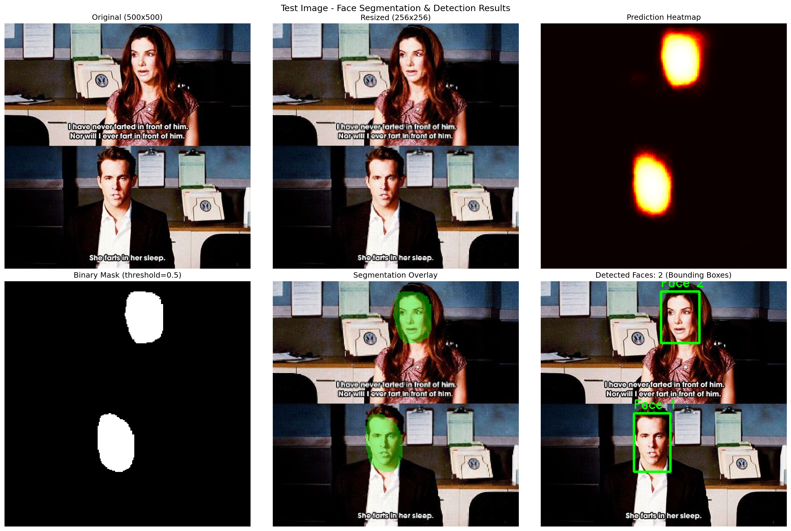
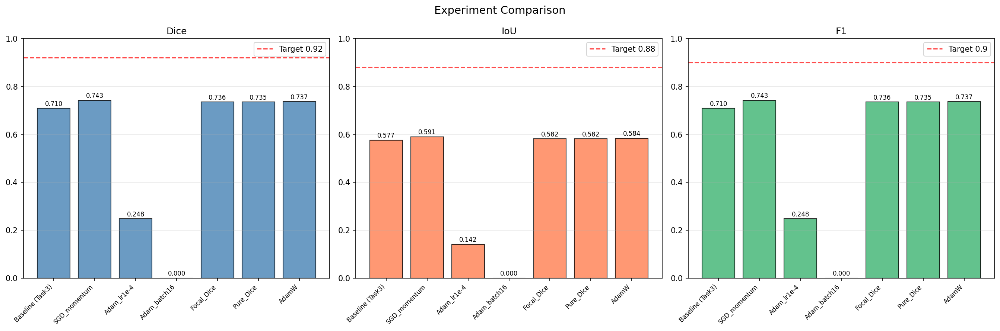

# 🎬 Scene Cast AI: Real-Time Face Segmentation for Movie Cast Identification

A deep learning-based face segmentation system that detects and segments faces in movie scene screenshots. Built with U-Net (MobileNetV2 encoder) and deployed via a Streamlit web application.

## Problem Statement

Company X's streaming app needs to automatically detect and segment faces in movie scene screenshots so users can pause videos and instantly view cast/crew details for actors on screen.

## Demo




## Project Structure

```
├── app.py                          # Streamlit web application
├── requirements.txt                # Python dependencies
├── README.md
├── data/
│   ├── Part 1- Train data - images.npy
│   └── Part 1Test Data - Prediction Image.jpeg
├── models/
│   ├── unet_face_segmentation.h5           # Trained model weights (.h5)
│   ├── unet_face_segmentation.weights.h5   # Weights only
│   ├── exp_SGD_momentum.keras              # Best experiment model
│   └── best_phase1.keras                   # Baseline model
├── notebooks/
│   ├── Task1_EDA.ipynb                     # Data loading & exploratory analysis
│   ├── Task2_Preprocessing.ipynb           # Resize, normalize, augment, split
│   ├── Task3_Model_Training.ipynb          # U-Net build, train, fine-tune
│   └── Task4_Evaluation_Finetuning.ipynb   # Metrics, hyperparameter experiments
└── reports/
    ├── experiment_comparison.png
    ├── test_prediction.png
    └── baseline_predictions.png
```

## Approach

### 1. EDA & Preprocessing
- Loaded 409 movie scene images with bounding-box face annotations
- Converted annotations to binary segmentation masks
- Resized all images and masks to 256×256
- Normalized pixel values to [0, 1]
- Applied data augmentation: horizontal flip, rotation (±15°), brightness, Gaussian blur
- Train/Validation split: 80/20 (327 train, 82 val)

### 2. Model Architecture
- **Encoder**: MobileNetV2 (pretrained on ImageNet, transfer learning)
- **Decoder**: Custom decoder with skip connections, SeparableConv2D, BatchNormalization, SpatialDropout2D
- **Output**: Sigmoid activation for binary mask prediction (256×256×1)
- **Loss**: BCE + Dice Loss (combined for stable training + overlap optimization)
- **Custom Metrics**: Dice Coefficient, IoU

### 3. Training Strategy
- **Phase 1**: Frozen encoder, train decoder only (80 epochs, Adam lr=1e-3)
- **Phase 2**: Fine-tune encoder blocks 14-16 (40 epochs, Adam lr=1e-5)
- Callbacks: ModelCheckpoint, EarlyStopping (patience=20), ReduceLROnPlateau
- Online augmentation via custom data generator

### 4. Hyperparameter Experiments

| Model | Dice | IoU | F1 | Precision | Recall | Speed (ms) |
|-------|------|-----|-----|-----------|--------|------------|
| Baseline (Task3) | 0.7095 | 0.5765 | 0.7095 | 0.6800 | 0.7400 | 93.6 |
| **SGD_momentum** | **0.7425** | **0.5905** | **0.7425** | **0.7073** | **0.7814** | **84.9** |
| Adam_lr1e-4 | 0.2480 | 0.1416 | 0.2480 | 0.1558 | 0.6071 | 81.9 |
| Adam_batch16 | 0.0000 | 0.0000 | 0.0000 | 0.0000 | 0.0000 | 84.0 |
| Focal_Dice | 0.7358 | 0.5821 | 0.7358 | 0.6648 | 0.8240 | 83.5 |
| Pure_Dice | 0.7354 | 0.5815 | 0.7354 | 0.7065 | 0.7667 | 89.0 |
| AdamW | 0.7374 | 0.5841 | 0.7374 | 0.6787 | 0.8073 | 110.0 |

### Key Observations
- **SGD with momentum** achieved the best Dice (0.7425), outperforming Adam on this small dataset
- **Focal+Dice loss** achieved the highest recall (0.8240), better at detecting face boundary pixels
- **Batch size 16** failed completely — too few gradient updates per epoch for 327 training images
- **Low LR (1e-4)** with frozen encoder couldn't learn enough in 30 epochs
- All working models cluster around Dice 0.73-0.74, suggesting the ceiling is due to bounding-box annotations (not pixel-perfect masks) and small dataset size

## Streamlit App Features

- **Image Upload**: Upload any movie scene screenshot (JPG, PNG, BMP, WebP)
- **Face Detection**: Bounding boxes with confidence scores overlaid on detected faces
- **Segmentation Overlay**: Green mask overlay showing segmented face regions
- **Prediction Heatmap**: Confidence heatmap visualization
- **Performance Dashboard**: Processing time, face count, average confidence
- **Download & Export**: Detection logs (JSON), face masks (PNG), annotated images
- **Detection History**: Session-based log of all processed images

## Installation & Usage

### Prerequisites
- Python 3.10+
- pip

### Setup
```bash
git clone https://github.com/your-username/face-segmentation-project.git
cd face-segmentation-project
pip install -r requirements.txt
```

### Run Streamlit App
```bash
streamlit run app.py
```

### Run Notebooks (Google Colab recommended for GPU)
1. Upload notebooks from `notebooks/` to Google Colab
2. Upload data files from `data/` to Colab
3. Enable GPU: Runtime → Change runtime type → T4 GPU
4. Run notebooks in order: Task1 → Task2 → Task3 → Task4

## Tech Stack

- **Deep Learning**: TensorFlow / Keras
- **Model**: U-Net with MobileNetV2 encoder (transfer learning)
- **Computer Vision**: OpenCV
- **Web App**: Streamlit
- **Data Science**: NumPy, Pandas, Matplotlib, Seaborn, scikit-learn
- **Training**: Google Colab (T4 GPU)

## Custom Dice Loss & Metric

```python
def dice_coefficient(y_true, y_pred, smooth=1e-6):
    y_true_f = keras.ops.cast(keras.ops.reshape(y_true, [-1]), 'float32')
    y_pred_f = keras.ops.cast(keras.ops.reshape(y_pred, [-1]), 'float32')
    inter = keras.ops.sum(y_true_f * y_pred_f)
    return (2.*inter+smooth) / (keras.ops.sum(y_true_f)+keras.ops.sum(y_pred_f)+smooth)

def dice_loss(y_true, y_pred):
    return 1.0 - dice_coefficient(y_true, y_pred)
```

## Results

- **Best Model**: SGD with Momentum
- **Dice Coefficient**: 0.7425
- **IoU**: 0.5905
- **F1-Score**: 0.7425
- **Inference Speed**: ~85ms/image (GPU)

## License

This project is for educational purposes as part of the GUVI Final Project.
